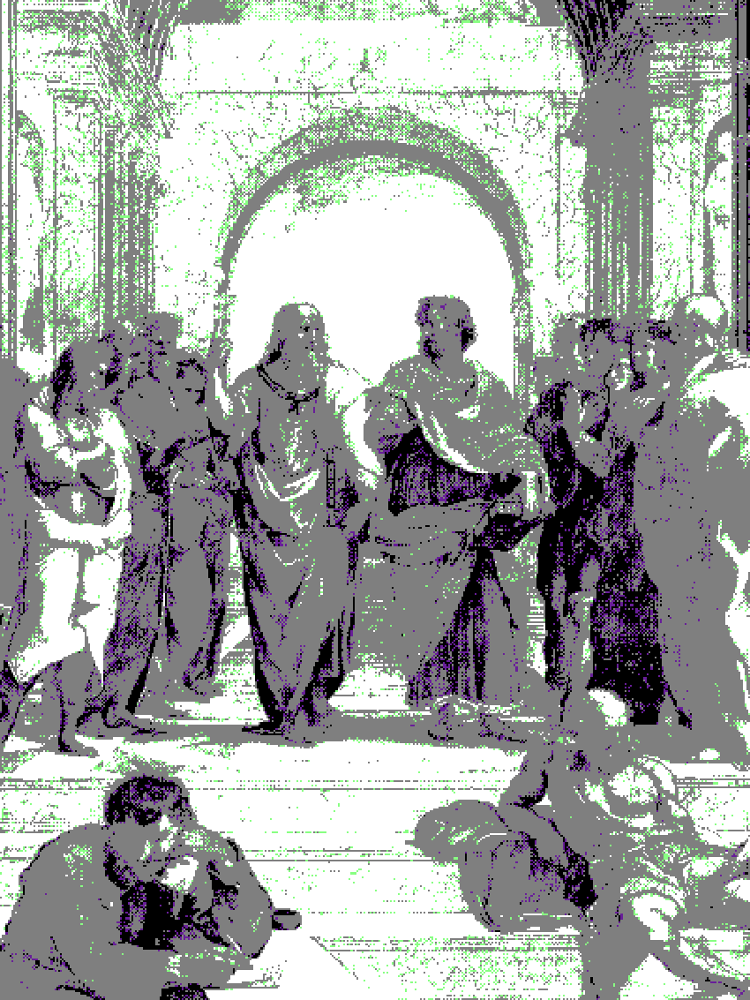

<table>
  <tr>
    <td  width="400">
      
    </td>
    <td valign="top">
      <h1>Joaquim Silva</h1>
      
Engineer focused on reliability, performance, and distributed systems. Building infrastructure that never sleeps.

      <h2>Technologies</h2>
      <ul>
        <li>Languages: Go, TypeScript, Python, Bash</li>
        <li>Cloud & Infra: AWS, Azure, GCP, Kubernetes, Docker, Terraform</li>
        <li>Databases: PostgreSQL, Redis, Cassandra, MongoDB</li>
        <li>Practices: Clean Architecture, CI/CD, Observability, SRE</li>
      </ul>
      <h2>Contact</h2>
      <ul>
        <li>Twitter: <a href="https://x.com/joaquimsnjunior">joaquimsnjunior</a></li>
        <li>LinkedIn: <a href="https://www.linkedin.com/in/joaquimsnjr/">Joaquim Silva</a></li>
        <li>Website: <a href="https://joaquimsnjr.tech">JoaquimSNJr</a></li>
      </ul>
    </td>
  </tr>
</table>
